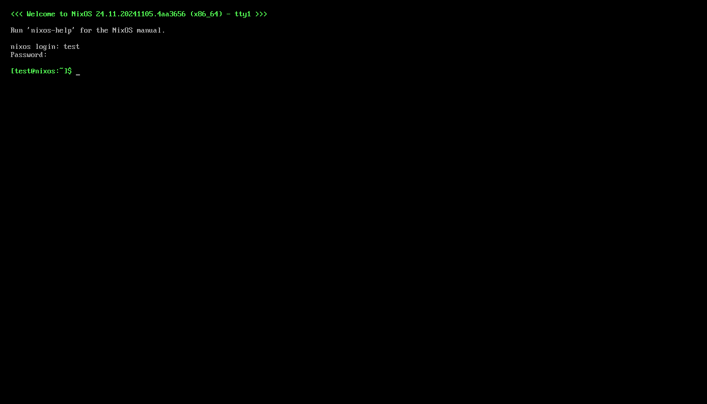
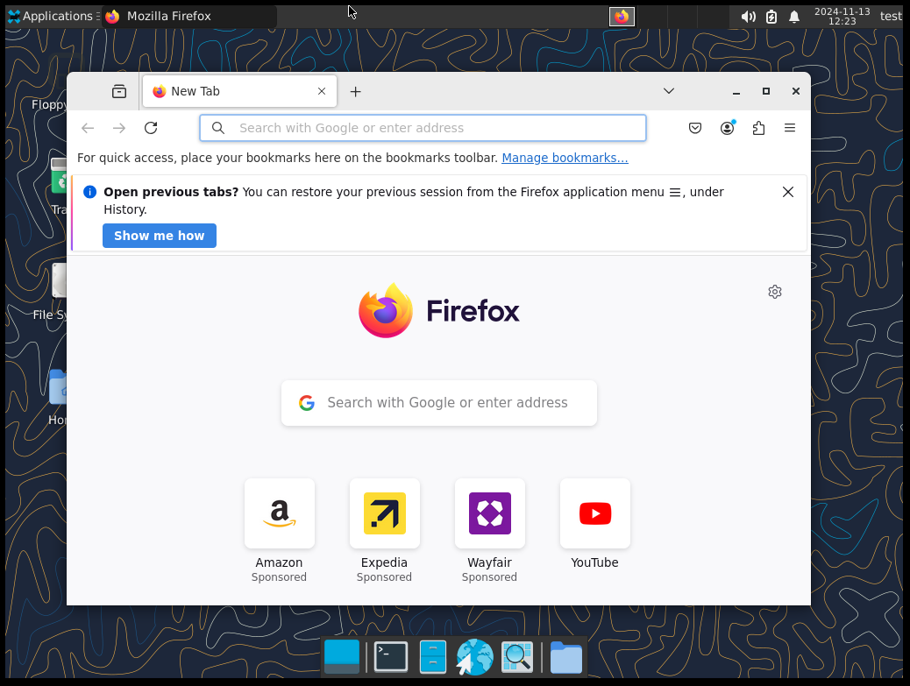
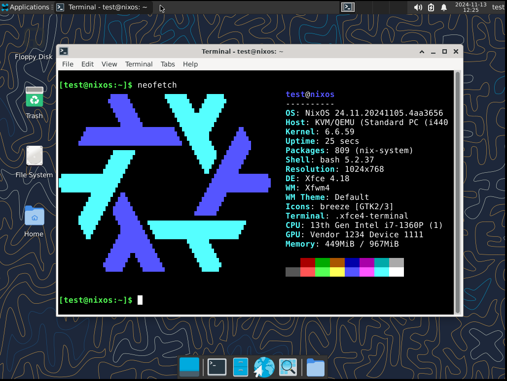

import { Aside, Steps, FileTree, LinkCard } from "@astrojs/starlight/components";

Welcome! This chapter will start you off on your journey with Nix/NixOS.

In this chapter we will...

1. Install Nix on your current distro
2. Go over using the basic parts of the Nix CLI
3. Set up a basic NixOS VM with Nix
4. Go over the basics of configuring a NixOS system

## Installing Nix (Lix)

Before we even start with NixOS, we're going to use `Nix` to build a VM we can test with. This VM will eventually be the system you'll install.

We'll *actually* be using a fork of Nix called Lix. This fork fixes some common bugs and turns on some features we'll be using by default.

To install Lix, follow [the Lix installation guide](https://lix.systems/install/#on-any-other-linuxmacos-system).

<LinkCard target="_blank" title="Lix Installation Guide" href="https://lix.systems/install/#on-any-other-linuxmacos-system" />

```sh
curl -sSf -L https://install.lix.systems/lix | sh -s -- install
```

<Aside title="Lix Installation">
Note that in order to use this guide **you need to enable flakes** when the installer
prompts you to.
</Aside>

After installing, check that you can run Nix.

```sh
nix --version
```

## Basic Nix CLI

Nix is a package manager that can run on many systems. One of the nice things it can do is run a package without needing to install it!

```sh
nix run "nixpkgs#python3"
```

We can run Python!

```sh
nix shell "nixpkgs#python3"
python --version
```

And we can run a shell with Python in scope!

Here we're asking for `python3` from `nixpkgs` (the primary package repository). In the first command we simply run the package's default binary. In the second we bring the package into scope, meaning we can execute any commands it provides.

We'll get into more later, just keep in mind we can run any package in [nixpkgs](https://search.nixos.org/packages?channel=unstable&size=500) like this!

## Creating a NixOS VM with Nix

Now let's get into creating a NixOS VM. This VM will eventually become the system you install on your actual device.

To start out, make a new folder to contain this project. In this new folder initialize a new Nix flake.

```sh
nix flake init
```

This should create a new file, `flake.nix`.

<FileTree>
- **flake.nix**
</FileTree>

A flake is a Nix "project", it's written as a *nix expression* (specifically an *attr set*).

```nix title="flake.nix"
{
  description = "A very basic flake";

  inputs = {
    nixpkgs.url = "github:nixos/nixpkgs?ref=nixos-unstable";
  };

  outputs = { self, nixpkgs }: {
    packages.x86_64-linux.hello = nixpkgs.legacyPackages.x86_64-linux.hello;
    packages.x86_64-linux.default = self.packages.x86_64-linux.hello;
  };
}
```

Opening the `flake.nix` we can see the expression. Let's walk through what each part means.

<Steps>
1. We have an attribute named `description` that's a string.
2. We have another attribute called `inputs` that's an attr set. 
   This attr set contains an attribute named `nixpkgs`, which is another attr set.
   Within that we set `url` to `github:nixos/nixpkgs?ref=nixos-unstable`.
   <Aside>
    When you see the `X.Y = Z;` syntax,
    ```nix "nixpkgs.url = "
    {
      inputs = {
        nixpkgs.url = "github:nixos/nixpkgs?ref=nixos-unstable";
      };
    }
    ```
    It is directly equivalent to `X = { Y = Z; };`.
    ```nix /(nixpkgs) =/ "url = "
    {
      inputs = { 
        nixpkgs = {
          url = "github:nixos/nixpkgs?ref=nixos-unstable";
        };
      };
    }
    ```
    Nix provides the `.` notation as a shorthand way to define nested attr sets.
    </Aside>
3. We have one more attribute named `outputs` that's a *function*.
   This function takes `self`, which is a reference to this flake, and `nixpkgs`, which is the input we defined in `inputs`.
4. Within this function we return two *packages* (placed in the `packages.x86_64-linux` attr set).
   We set `hello` equal to an example package in `nixpkgs` and we set `default` to a recursive reference to our own `hello` package.
</Steps>

This is the basic structure of a flake. We have `inputs`, which define dependencies for our flake. And we have `outputs`, which is a function that will be passed those inputs to output *something*. 

This "something" could be packages (As it is now), NixOS configurations (as we'll do in a bit), and much more. Flakes are a general purpose way to share Nix code between projects. 

<Aside>
The `nixpkgs` input we're defining is actually another flake located at [https://github.com/NixOS/nixpkgs/blob/nixos-unstable/flake.nix](https://github.com/NixOS/nixpkgs/blob/nixos-unstable/flake.nix).
</Aside>

### Setting Up Flake.nix

We're going to make a few changes to `flake.nix` to prepare for a NixOS config.

<Aside title="Editor Recommendation">
I'd recommend grabbing `bbenoist.Nix` for VSCode for editing Nix files.
</Aside>

<Steps>
1. Remove the template lines that output the `hello` and `default` packages.
    ```nix title="flake.nix" del={9-10}
    {
      description = "A very basic flake";

      inputs = {
        nixpkgs.url = "github:nixos/nixpkgs?ref=nixos-unstable";
      };

      outputs = { self, nixpkgs }: {
        packages.x86_64-linux.hello = nixpkgs.legacyPackages.x86_64-linux.hello;
        packages.x86_64-linux.default = self.packages.x86_64-linux.hello;
      };
    }
    ```
2. Create a `let` statement before our return in `outputs`.
    ```nix title="flake.nix" ins=" let" ins="in " ins={12}
    {
      description = "A very basic flake";

      inputs = {
        nixpkgs.url = "github:nixos/nixpkgs?ref=nixos-unstable";
      };

      outputs = { 
        self, 
        nixpkgs 
      }: let
      
      in {
      };
    }
    ```
    <Aside>
    A `let` block allows us to define variables we want to use in the expression after `in`.
    ```nix
    {
      answer = let x = 5; y = 6; in x + y;
    }
    ```
    This will fill in `x` and `y` and evaluate to `11`.
    ```nix
    {
      answer = 11;
    }
    ```
    </Aside>
3. Add `system` to the let block, we want this to be `x86_64-linux` as that's the system we'll make a VM for (and install on).  
    ```nix title="flake.nix" ins={12}
    {
      description = "A very basic flake";

      inputs = {
        nixpkgs.url = "github:nixos/nixpkgs?ref=nixos-unstable";
      };

      outputs = { 
        self, 
        nixpkgs 
      }: let
        system = "x86_64-linux";
      in {
      };
    }
    ```
4. Add `pkgs` to the let block, we'll `import nixpkgs` here, specifying the system we want `nixpkgs` to target.  
    ```nix title="flake.nix" ins={13-15}
    {
      description = "A very basic flake";

      inputs = {
        nixpkgs.url = "github:nixos/nixpkgs?ref=nixos-unstable";
      };

      outputs = { 
        self, 
        nixpkgs 
      }: let
        system = "x86_64-linux";
        pkgs = import nixpkgs {
          inherit system;
        };
      in {
      };
    }
    ```
    A few new pieces of syntax here.

    <Aside>
    `import` is saying "evaluate this file and return the result". In this case we're evaluating [the `default.nix` file](https://github.com/NixOS/nixpkgs/blob/master/default.nix) in the `nixpkgs` flake repo.
    </Aside>

    <Aside>
    The result of `import nixpkgs` is a function, we call that function by passing its argument after a space, this is called function application. This may be a bit confusing coming from a non-functional programming language.
    ```nix
    let addFive = x: x + 5; in {
      answer = addFive 4; # Most languages would do `addFive(4);`
    }
    ```
    This block will evaluate to `9`.
    ```nix
    {
      answer = 9;
    }
    ```
    In the case of our `import` statement, we're calling it with an attr set as the argument.
    </Aside>

    <Aside>
    The `inherit` keyword here is a shortcut for saying `system = system;`.
    </Aside>
</Steps>

With these changes we've:

1. Defined a new variable, `system` that we'll use in places we need to specify which system to use (like 2 lines later).
2. Instantiated `nixpkgs`, told it to target our `system`, and stored it in a variable called `pkgs`.

### Writing Our NixOS Config

Now we'll define a *NixOS Config*. A NixOS config is a nix expression that instructs on how to build a system. This configures everything from the bootloader and kernel to the DE the system will run.

We'll make our flake export this NixOS config, allowing us to use it with the Nix CLI (like how `nixpkgs` exports `python3`).

These steps will use the string `YOURNAME` to represent your system's name, you can set this to whatever you want, I'd recommend a `kebab-case` string.

<Steps>
1. First we'll add the output. Note that the start of the flake file isn't included here for brevity.
    ```nix title="flake.nix" "YOURNAME" ins={13-15}
    { 
      # ...

      outputs = { 
        self, 
        nixpkgs,
      }: let
        system = "x86_64-linux";
        pkgs = import nixpkgs {
          inherit system;
        };
      in {
        nixosConfigurations.YOURNAME = nixpkgs.lib.nixosSystem {

        };
      }; 
    }
    ```
    Here we're making a function call to `nixpkgs.lib.nixosSystem`, we're passing an attr set as an argument.
2. In this attr set, add a basic system configuration. We'll go over what it means in a sec.
    ```nix title="flake.nix" "YOURNAME" ins={12-15}
    { 
      outputs = { 
        self, 
        nixpkgs 
      }: let
        system = "x86_64-linux";
        pkgs = import nixpkgs {
          inherit system;
        };
      in {
        nixosConfigurations.YOURNAME = nixpkgs.lib.nixosSystem {
          inherit system pkgs;
          modules = [{

          }];
        };
      }; 
    }
    ```
    Here we're doing 2 things
    1. Inheritting `system` and `pkgs`, telling NixOS what system we're building for and what packages to use.
    2. Declaring an empty NixOS module. We'll fill this out next.
    <Aside>
    `modules` here is an *array* (of attr sets), this is pretty much the same as in normal programming. The only weird thing is we use spaces instead of commas to delimit the items.
    ```nix
    [1 2 3 4 5]
    ```
    </Aside>
3. Configure our NixOS system. In the attr set we're passing as the only item to the `modules` array, we'll set some basic options.
    In this code block, `YOURUSER` can be replaced with the username you wish to use, I'd recommend an all lowercase string.
    ```nix title="flake.nix" "YOURNAME" "YOURUSER" "asdf"
    {
      nixosConfigurations.YOURNAME = nixpkgs.lib.nixosSystem {
        inherit system pkgs;
        modules = [{
          system.stateVersion = "24.11";
          users.users.YOURUSER = {
            isNormalUser = true;
            password = "asdf"; # Change as desired, only for testing!
            extraGroups = ["networkmanager" "wheel"]; # No commas between array items!
          };
          services.qemuGuest.enable = true;
        }];
      };
    }
    ```
    Big config here, let's break it down.

    1. `system.stateVersion` sets the *major* version of NixOS to use.
    2. `users.users.YOURUSER` configures your account to be a normal user, sets your password to `asdf`, and makes you a sudoer.
    3. `services.qemuGuest.enable` enables some features that'll make the VM nicer to use.

    <Aside>
      We set password hardcoded here for ease-of-use, later on we'll remove it in favor of setting it ourselves after installing.
    </Aside>
</Steps>

We now have a very basic config set up, let's boot it!

## Running The VM

We have now configured a basic NixOS VM! With that small Nix expression we've represented a minimal NixOS system with one user.

On an actual NixOS system we'd try to *switch* to this config, but we'll utilize a different NixOS feature to run a VM instead.

NixOS exports a package under every system config called `build.vm` that builds and runs a VM image for us!

Replace `YOURNAME` in the following command with the name you configured for your system.

```sh "YOURNAME"
nix run .#nixosConfigurations.YOURNAME.config.system.build.vm
```

This is similar to what we did with `nixpkgs#python3` above. Instead of `nixpkgs` we're grabbing from the flake in the current directory (`.`). And the package we want is `nixosConfigurations.YOURNAME.config.system.build.vm`.

Run the command and wait for the VM to start. Use the username and password you configured above to login.



We've now successfully started a NixOS VM! 

## Separating Out Our Config

Right now we're configuring everything within `flake.nix`. While this works, it can get a bit messy to have *everything* in one file as you'll likely set *many* options.

To fix this, instead of defining our module inline we can separate it out into another nix file. 

<Steps>
1. Create a new file called `config.nix`.
    <FileTree>
    - flake.nix
    - flake.lock
    - ...
    - **config.nix**
    </FileTree>
2. In this file we'll put another Nix expression. But unlike `flake.nix` (where the top-level expression is an attr set), we'll make this top-level expression a *function*.
    ```nix title="config.nix"
    {pkgs, ...}: {

    }
    ```
    Here we're defining a function that takes one argument, an attr set. NixOS will pass many attributes to us through this set, but for now we only want `pkgs`.
    <Aside>
    The `...` syntax in an attr set is a way to ignore all other attributes not previously stated.
    </Aside>
    <Aside>
    The attributes of this attr set are also referred to as the module's arguments. So when we're talking about modules and we say "arguments", keep in mind what we *really* mean is the attributes of the singular, actual attr set argument.
    </Aside>
3. Now, we can move the code we previously had inline...
    ```nix title="flake.nix" "YOURNAME" "YOURUSER" "asdf" del={5-11} del="[{" del="}]"
    {
      nixosConfigurations.YOURNAME = nixpkgs.lib.nixosSystem {
        inherit system pkgs;
        modules = [{
          system.stateVersion = "24.11";
          users.users.YOURUSER = {
            isNormalUser = true;
            password = "asdf";
            extraGroups = ["networkmanager" "wheel"];
          };
          services.qemuGuest.enable = true;
        }];
      };
    }
    ```
4. And move it over to `config.nix`.
    ```nix title="config.nix" "YOURNAME" "YOURUSER" "asdf" ins={2-8}
    {pkgs, ...}: {
      system.stateVersion = "24.11";
      users.users.YOURUSER = {
        isNormalUser = true;
        password = "asdf";
        extraGroups = ["networkmanager" "wheel"];
      };
      services.qemuGuest.enable = true;
    }
    ```
5. Finally, we need to tell NixOS about `config.nix`, we do this by putting it in `modules`.
    ```nix title="flake.nix" "YOURNAME" ins="[./config.nix]"
    {
      nixosConfigurations.YOURNAME = nixpkgs.lib.nixosSystem {
        inherit system pkgs;
        modules = [./config.nix]; # Note the lack of quotes!
      };
    }
    ```
    <Aside>
    Note the lack of quotes around the path to `config.nix`. We'll get into what this does later, just know it's not the same as passing the path as a string.
    </Aside>
</Steps>

Run the VM again, make sure the system still builds and works.

```sh "YOURNAME"
nix run .#nixosConfigurations.YOURNAME.config.system.build.vm
```

## Customization

Now for the fun stuff! Let's try adding a DE to the system.

I'll use XFCE here for simplicity, but feel free to change this later!

```nix title="config.nix" ins={4-5}
{pkgs, ...}: {
  # ...

  services.xserver.enable = true;
  services.xserver.desktopManager.xfce.enable = true;
}
```

Adding a DE is as simple as this! Opposed to imperatively installing a package like with other distros, we declaratively *enable* the ones that we want.

We'll get into how we can find more options and packages later. For now, try running the VM and check out XFCE.


### Configuring Nix with Nix

Before we do anything else we're going to configure Nix within our system. This way when we install, Nix will be setup how we expect it.

```nix title="config.nix" ins={5-19}
{pkgs, ...}: {

  # ...

  nix = {
    channel.enable = false;
    package = pkgs.lix;
    settings = {
      experimental-features = [
        "nix-command"
        "flakes"
      ];
      auto-optimise-store = true;
    };
    gc = {
      automatic = true;
      dates = "weekly";
    };
  };
}
```

Big block here, let's go over what this all does.

- We disable channels, they're a different system usually used in place of flakes, but we like flakes so we'll disable them.
- We set the underlying Nix implementation to be `lix`, just like on our host system.
- Next in `settings` we enable a few `nix` options.
  - We enable a few experimental features, flakes and the new CLI (the CLI you're using right now).
  - We enable nix store opimization, makes stuff more space efficient.
- We configure garbage collection to run automatically once a week, I'll explain what garbage collection is later.

## Installing Programs

When installing programs or enabling features, there are two methods you can use.

### Method 1: NixOS Options

Many popular programs or features have NixOS options built-in, this is how we can simply do `services.xserver.desktopManager.xfce.enable = true;` for example.

In order to find the options that are available to us, we can use the [NixOS Option Search](https://search.nixos.org/options?channel=unstable). This will show you all the options that NixOS provides.

<LinkCard target="_blank" title="NixOS Option Search" href="https://search.nixos.org/options?channel=unstable" />

#### Example: Adding Firefox

Let's say I want to use Firefox on my system. To do this I first look up "firefox" on the option search. 

I can see that there's an option, [programs.firefox.enable](https://search.nixos.org/options?channel=unstable&show=programs.firefox.enable&from=0&size=500&sort=relevance&type=packages&query=firefox). Like the name implies this option will enable firefox on my system.

Because NixOS provides an option for this, all I have to do is add it to my config.

```nix title=config.nix ins={5} 
{pkgs, ...}: {

  # ...

  programs.firefox.enable = true;
}
```

When building my system, Nix will fetch the `firefox` package from `nixpkgs` for me and configure any other OS setting that might make using Firefox better (like setting it as a default browser).



### Method 2: Using Nixpkgs Directly

If we can't find our program through NixOS options search, that means there's no NixOS options that can install and configure the application for us.

However, we can still use [Nix packages search](https://search.nixos.org/packages?channel=unstable&size=500) to see if the package we want is still available.

<LinkCard target="_blank" title="Nix Package Search" href="https://search.nixos.org/packages?channel=unstable&size=500" />

If it is available, you can add the package (gotten trough the `pkgs` attr set we receive as an arg) to `environment.systemPackages` to install it.

This will install the package and add its commands to your `PATH` (as well as add other things, like man pages). However it may not configure other parts of the system to work well with it, you may need to do this manually.

#### Example: Installing Neofetch

Let's say I want to install `neofetch` on my system, however after checking for a NixOS option for it, it doesn't exist!

But, after [searching in Nixpkgs](https://search.nixos.org/packages?channel=unstable&show=neofetch&from=0&size=500&sort=relevance&type=packages&query=neofetch), I can see it's listed!

To add `neofetch` to my system without having an option for it, I can use `environment.systemPackages`.

```nix title=config.nix "with pkgs;" ins={5-7} 
{pkgs, ...}: {

  # ...

  environment.systemPackages = with pkgs; {
    neofetch
  };
}
```

<Aside>
The `with` keyword is a handy way to bring all attributes of `pkgs` into scope, so instead of having to do `pkgs.neofetch`, I can just do `neofetch`.
</Aside>

We now have `neofetch` installed!



## Experiment

From here I'd recommend trying out programs, options, etc. You now know the basics of configuring NixOS!

However, there's much you must learn before you can install and daily drive. The following guides will go through some more advanced concepts.
