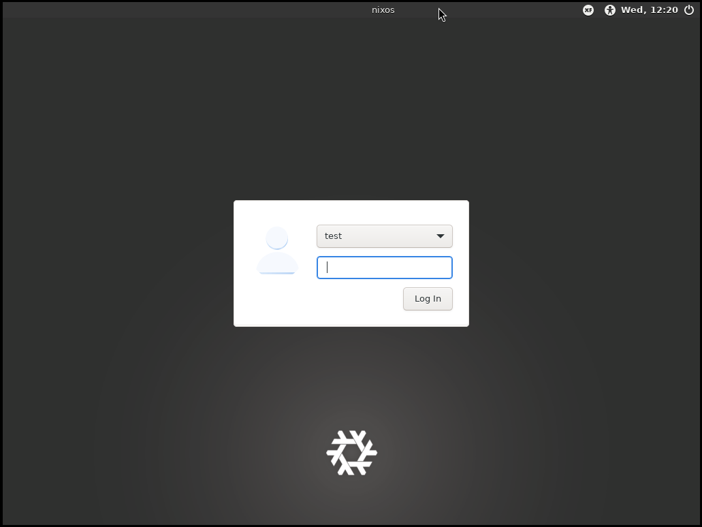

import { Aside, Steps, FileTree, LinkCard } from "@astrojs/starlight/components";

Welcome! This chapter will start you off on your journey with Nix/NixOS!

In this chapter we will...

1. Install Nix on your current distro
2. Go over using the basic parts of the Nix CLI
3. Set up a basic NixOS VM with Nix
4. Go over the basics of configuring a NixOS system

## Installing Nix (Lix)

Before we even start with NixOS, we're going to use `Nix` to build a VM we can use to test with.
This VM will eventually be the system you'll install.

We'll *actually* be using a fork of Nix called Lix. This fork fixes some common bugs and turns on some features we'll be using by default.

To install Lix, follow [the Lix installation guide](https://lix.systems/install/#on-any-other-linuxmacos-system).

<LinkCard target="_blank" title="Lix Installation Guide" href="https://lix.systems/install/#on-any-other-linuxmacos-system" />

```sh
curl -sSf -L https://install.lix.systems/lix | sh -s -- install
```

After installing, check that you can run Nix.

```sh
nix --version
```

## Basic Nix CLI

Nix is a package manager that can run on many systems. One of the nice things it can do is run a package without needing to install it.

```sh
nix run "nixpkgs#python3"
```

We can run Python!

```sh
nix shell "nixpkgs#python3"
python --version
```

And we can run a shell with Python in scope!

Here we're asking for `python3` from `nixpkgs` (the primary package repository). In the first command we simply run the package's default binary. In the second we bring the package into scope, meaning we can execute any commands it provides.

We'll get into more later, just keep in mind we can run any package in [nixpkgs](https://search.nixos.org/packages?channel=unstable&size=500)
like this!

## Creating a NixOS VM with Nix

Now let's get into creating a NixOS VM. This VM will eventually become the system you install on your actual device.

To start out make a new folder to contain this project. In this new folder initialize a new Nix flake.

```sh
nix flake init
```

This should create a new file, `flake.nix`

<FileTree>
- **flake.nix**
</FileTree>

A flake is like a Nix "project". It's written as *nix expression*, specifically an *attr set*.

```nix title="flake.nix"
{
  description = "A very basic flake";

  inputs = {
    nixpkgs.url = "github:nixos/nixpkgs?ref=nixos-unstable";
  };

  outputs = { self, nixpkgs }: {
    packages.x86_64-linux.hello = nixpkgs.legacyPackages.x86_64-linux.hello;
    packages.x86_64-linux.default = self.packages.x86_64-linux.hello;
  };
}
```

Opening the `flake.nix` we can see this expression. Let's walk through what each part means.

<Steps>
1. We have an attribute named `description` that's a string.
2. We have another attribute called `inputs` that's an attr set. 
   This attr set contains an attribute named `nixpkgs` which is another attr set.
   Within that we set `url` to `github:nixos/nixpkgs?ref=nixos-unstable`.
   <Aside>
    When you see this syntax
    ```nix "nixpkgs.url = "
    {
      inputs = {
        nixpkgs.url = "github:nixos/nixpkgs?ref=nixos-unstable";
      };
    }
    ```
    It is directly equivalent to
    ```nix /(nixpkgs) =/ "url = "
    {
      inputs = { 
        nixpkgs = {
          url = "github:nixos/nixpkgs?ref=nixos-unstable";
        };
      };
    }
    ```
    Nix provides the `.` notation as a shorthand way to define nested attr sets.
    </Aside>
3. We have one more attribute named `outputs` that's a *function*.
   This function takes `self`, which is a reference to this flake, and `nixpkgs`, which is the input we defined in `inputs`.
4. Within this function we return two *packages* (placed in the `packages.x86_64-linux` attr set).
   We set `hello` equal to an example package in `nixpkgs` and we set default to a recursive reference to our own `hello` package.
</Steps>

This is the basic structure of a flake. We have `inputs`, which define dependencies for or flake. And we have `outputs`, which is a function that can be passed those inputs to output *something*. 

This "something" could be packages (As it is now), NixOS configurations (as we'll do in a bit), and much more. Flakes are a general purpose way to share Nix code between projects. The `nixpkgs` input we're defining is actually another flake located at [https://github.com/NixOS/nixpkgs/blob/nixos-unstable/flake.nix](https://github.com/NixOS/nixpkgs/blob/nixos-unstable/flake.nix).

### Setting Up Flake.nix

We're going to need to make a few changes to `flake.nix` to prepare to add a NixOS config.

<Aside title="Editor Recommendation">
I'd recommend grabbing `bbenoist.Nix` for VSCode for editing Nix files.
</Aside>

<Steps>
1. Remove the template lines that output `hello` and `default`.
    ```nix title="flake.nix" del={9-10}
    {
      description = "A very basic flake";

      inputs = {
        nixpkgs.url = "github:nixos/nixpkgs?ref=nixos-unstable";
      };

      outputs = { self, nixpkgs }: {
        packages.x86_64-linux.hello = nixpkgs.legacyPackages.x86_64-linux.hello;
        packages.x86_64-linux.default = self.packages.x86_64-linux.hello;
      };
    }
    ```
2. Create a `let` statement before our return in `outputs`.
    ```nix title="flake.nix" ins=" let" ins="in " ins={12}
    {
      description = "A very basic flake";

      inputs = {
        nixpkgs.url = "github:nixos/nixpkgs?ref=nixos-unstable";
      };

      outputs = { 
        self, 
        nixpkgs 
      }: let
      
      in {
      };
    }
    ```
    <Aside>
    A `let` block allows us to define variables we want to use in the expression after `in`.
    </Aside>
3. Add `system` to the let block, we want this to be `x86_64-linux` as that's the system we'll make a VM for.  
    ```nix title="flake.nix" ins={12}
    {
      description = "A very basic flake";

      inputs = {
        nixpkgs.url = "github:nixos/nixpkgs?ref=nixos-unstable";
      };

      outputs = { 
        self, 
        nixpkgs 
      }: let
        system = "x86_64-linux";
      in {
      };
    }
    ```
4. Add `pkgs` to the let block, we'll `import` `nixpkgs` here, specifying the system we want `nixpkgs` to be for.  
    ```nix title="flake.nix" ins={13-15}
    {
      description = "A very basic flake";

      inputs = {
        nixpkgs.url = "github:nixos/nixpkgs?ref=nixos-unstable";
      };

      outputs = { 
        self, 
        nixpkgs 
      }: let
        system = "x86_64-linux";
        pkgs = import nixpkgs {
          inherit system;
        };
      in {
      };
    }
    ```
    <Aside>
    The `inherit` keyword here is a shortcut for saying `system = system;`.
    </Aside>
</Steps>

With these changes we've:

1. Defined a new variable, `system` that we'll use in places we need to specify which system to use.
2. Imported `nixpkgs`, telling it to target our `system`, and storing it in a variable called `pkgs`.

### Writing Our NixOS Config

Now we'll define a *NixOS Config*. A NixOS config is a nix expression that represents a system. This configures everything from the bootloader and kernel to the DE the system will run.

We'll make our flake export this NixOS config, allowing us to use it with the Nix CLI.

These steps will use the string `YOURNAMEHERE` to represent your system's name, you can set this to whatever you want, I'd recommend a `kebab-case` string.

<Steps>
1. First we'll add the output. Note that the start of the flake file isn't included here for brevity
    ```nix title="flake.nix" "YOURNAME" ins={11-13}
    { 
      outputs = { 
        self, 
        nixpkgs 
      }: let
        system = "x86_64-linux";
        pkgs = import nixpkgs {
          inherit system;
        };
      in {
        nixosConfigurations.YOURNAME = nixpkgs.lib.nixosSystem {

        };
      }; 
    }
    ```
    Here we're making a *function call* to `nixpkgs.lib.nixosSystem`, we're passing an attr set as an argument.
2. In this attr set, add a basic system configuration. We'll go over what it means in a sec
    ```nix title="flake.nix" "YOURNAME" ins={12-15}
    { 
      outputs = { 
        self, 
        nixpkgs 
      }: let
        system = "x86_64-linux";
        pkgs = import nixpkgs {
          inherit system;
        };
      in {
        nixosConfigurations.YOURNAME = nixpkgs.lib.nixosSystem {
          inherit system pkgs;
          modules = [{

          }];
        };
      }; 
    }
    ```
    Here we're doing 2 things
    1. Inheritting `system` and `pkgs`, telling NixOS what system we're building for and what packages to use.
    2. Declaring an empty NixOS module. We'll fill this out next.
3. Configure our NixOS system. In the attr set we're passing as the only item to the `modules` array, we'll set some basic options.
    In this code block, `YOURUSER` can be replaced with the username you wish to use, I'd recommend an all lowercase string.
    ```nix title="flake.nix" "YOURNAME" "YOURUSER" "asdf"
    {
      nixosConfigurations.YOURNAME = nixpkgs.lib.nixosSystem {
        inherit system pkgs;
        modules = [{
          system.stateVersion = "24.11";
          users.users.YOURUSER = {
            isNormalUser = true;
            password = "asdf"; # Change as desired, only for testing!
            extraGroups = ["networkmanager" "wheel"]; # No commas between array items!
          };
          services.qemuGuest.enable = true;
        }];
      };
    }
    ```
    Big config here, let's break it down
    1. `system.stateVersion` sets the *major* version of NixOS to use
    2. `users.users.YOURUSER` configures your account to be a normal user, sets your password to `asdf`, and makes you a sudoer.
    3. `services.qemuGuest.enable` enables some features that'll make the VM nicer to use
</Steps>

<Aside>
We set password hardcoded here for ease-of-use, later on we'll remove it in favor of setting it ourselves after installing.
</Aside>

We now have a very basic config set up, let's boot it!

## Running The VM

We have now configured a basic NixOS VM! Given just that expression we've represented a minimal NixOS system with one user.

On an actual NixOS system we'd try to switch to this config, but we'll utilize a different NixOS feature to run a VM instead.

NixOS exports a package under every system config called `build.vm` that builds and runs a VM image for us!

Replace `YOURNAME` in the following command with the name you configured for your system.

```sh "YOURNAME"
nix run .#nixosConfigurations.YOURNAME.config.system.build.vm
```

This is similar to what we did with `nixpkgs#python3` above. Instead of `nixpkgs` we're grabbing from the flake in the current directory (`.`). And the package we want is `nixosConfigurations.YOURNAME.config.system.build.vm`.

Press enter and wait for the VM to start! Use the username and password you configured above to login.


We've now successfully started a NixOS VM! 

## Separating Out Our Config

Right now we're configuring everything within `flake.nix`. While this work it can get a bit messy to have *everything* in one file as you'll likely make *many* configuration changes.

To fix this instead of defining our module inline we can separate it out to another nix file. 

<Steps>
1. Create a new file called `config.nix`.
    <FileTree>
    - flake.nix
    - flake.lock
    - ...
    - **config.nix**
    </FileTree>
2. In this file we'll put another Nix expression. But unlike `flake.nix` we'll make this expression a *function*.
    ```nix title="config.nix"
    {pkgs, ...}: {

    }
    ```
    Here we're defining a function that takes one argument, `pkgs` (our `nixpkgs` instance we imported before), and *ignores* all other arguments (NixOS will pass more, so we have to do this).
3. Now, we can move the code we previously had inline...
    ```nix title="flake.nix" "YOURNAME" "YOURUSER" "asdf" del={5-11} del="[{" del="}]"
    {
      nixosConfigurations.YOURNAME = nixpkgs.lib.nixosSystem {
        inherit system pkgs;
        modules = [{
          system.stateVersion = "24.11";
          users.users.YOURUSER = {
            isNormalUser = true;
            password = "asdf";
            extraGroups = ["networkmanager" "wheel"];
          };
          services.qemuGuest.enable = true;
        }];
      };
    }
    ```
4. And move it over to `config.nix`
    ```nix title="config.nix" "YOURNAME" "YOURUSER" "asdf" ins={2-8}
    {pkgs, ...}: {
      system.stateVersion = "24.11";
      users.users.YOURUSER = {
        isNormalUser = true;
        password = "asdf";
        extraGroups = ["networkmanager" "wheel"];
      };
      services.qemuGuest.enable = true;
    }
    ```
5. Finally, we need to tell NixOS about `config.nix`, we do this by putting it in `modules`
    ```nix title="flake.nix" "YOURNAME" ins="[./config.nix]"
    {
      nixosConfigurations.YOURNAME = nixpkgs.lib.nixosSystem {
        inherit system pkgs;
        modules = [./config.nix]; # Note the lack of quotes!
      };
    }
    ```
    <Aside>
    Note the lack of quotes around the path to `config.nix`. We'll get into exactly what this does later, just know it's not the same as passing *just* the path as a string
    </Aside>
</Steps>

Run `nix run` again to build and launch the VM again, make sure the system still works.

## Customization

Now for the fun stuff! Let's try adding a DE to the system.

```nix title="config.nix" ins={4-5}
{pkgs, ...}: {
  # ...

  services.xserver.enable = true;
  services.xserver.desktopManager.xfce.enable = true;
}
```

Adding a DE is as simple as this! Opposed to installing a package we simply *enable* the one that we want.

We'll get into how we can find more options and add packages there aren't explicit options for later. For now, try running the VM again and check out XFCE.



### Configuring Nix with Nix

Before we do anything else we're going to configure Nix within our system similar to how we have it configured outside the system. This will be used a bit later.

```nix title="config.nix" ins={5-19}
{pkgs, ...}: {

  # ...

  nix = {
    channel.enable = false;
    package = pkgs.lix;
    settings = {
      experimental-features = [
        "nix-command"
        "flakes"
      ];
      auto-optimise-store = true;
    };
    gc = {
      automatic = true;
      dates = "weekly";
    };
  };
}
```

Big block here, let's go over what this all does.

- First we disable channels, they're a different system usually used in place of flake, but we're going to use flakes so we don't need it
- Then we set the underlying Nix implementation to be `lix`, just like on our host system.
- Next in settings we enable a few options
  - We enable a few experimental features, like flakes and the new CLI
  - We enable nix store opimization
- We configure garbage collection to run automatically once a week, we'll explain what `gc` is later

## Installing Programs

When it comes to installing programs or enabling features, there are two methods you can use.

### Method 1: NixOS Options

Many popular programs or features have NixOS options built-in, this is how we can simply do `services.desktopManager.xfce.enable = true`;

In order to find options that we can set we can use the [NixOS Option Search](https://search.nixos.org/options?channel=unstable). This will show you options that NixOS provides.

<LinkCard target="_blank" title="NixOS Option Search" href="https://search.nixos.org/options?channel=unstable" />

#### Example: Firefox

Let's say I want to use Firefox on my system. To do this I first look up "firefox" on the option search. 

I can see that there's an option, [programs.firefox.enable](https://search.nixos.org/options?channel=unstable&show=programs.firefox.enable&from=0&size=500&sort=relevance&type=packages&query=firefox).

```nix title=config.nix ins={5} 
{pkgs, ...}: {

  # ...

  programs.firefox.enable = true;
}
```

When building my system, Nix will fetch the `firefox` package from `nixpkgs` for me and configure any other OS setting that might make using Firefox better (like setting it as a default browser).


### Method 2: Using Nixpkgs Directly

If we can't find our program through NixOS options search, that means there's no NixOS options that can install and configure the application for us.

However, we can still use [Nix packages search](https://search.nixos.org/packages?channel=unstable&size=500) to see if the package we want is available at all.

<LinkCard target="_blank" title="Nix Package Search" href="https://search.nixos.org/packages?channel=unstable&size=500" />

If it is available, you can add the package (gotten trough the `pkgs` attr set we receive as an arg) to `environment.systemPackages` to install it.

This will install the package and add its commands to your `PATH`, but it may not configure other parts of the system to work well with it, you may need to do this manually.

#### Example: Neofetch

For example, I want to install `neofetch` on my system, however after checking for a NixOS option for it, it doesn't exist.

But, after [searching in Nixpkgs](https://search.nixos.org/packages?channel=unstable&show=neofetch&from=0&size=500&sort=relevance&type=packages&query=neofetch), I can see it exists!

To add `neofetch` to my system without having an option for it, I can use `environment.systemPackages`

```nix title=config.nix "with pkgs;" ins={5-7} 
{pkgs, ...}: {

  # ...

  environment.systemPackages = with pkgs; {
    neofetch
  };
}
```

<Aside>
The `with` keyword is a handy way to bring all attributes of `pkgs` into scope, so instead of having to do `pkgs.neofetch`, I can just do `neofetch`.
</Aside>

We now have neofetch installed!


## Experiment

From here I'd recommend trying out programs, options, etc. You now know the basics of configuring NixOS!

However, there's much you must learn before you can install and daily drive. The following guides will go through some more advanced concepts. Stay tuned!
