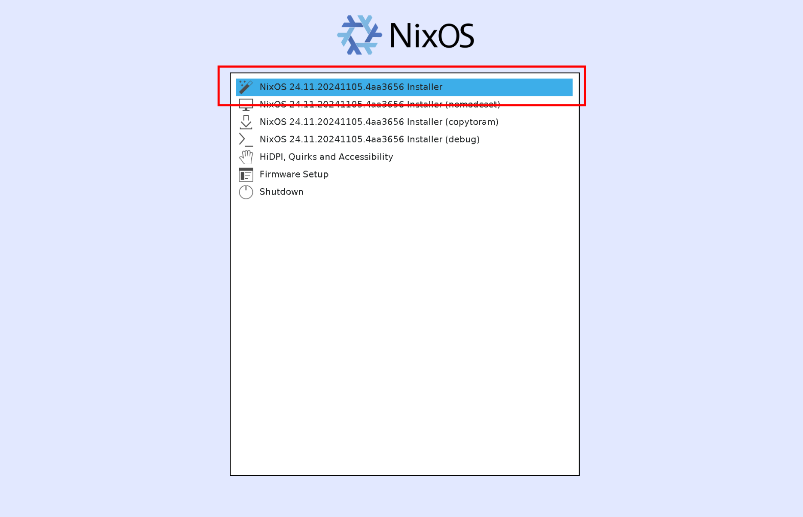
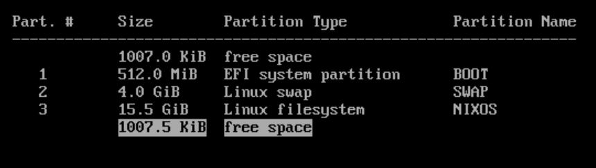
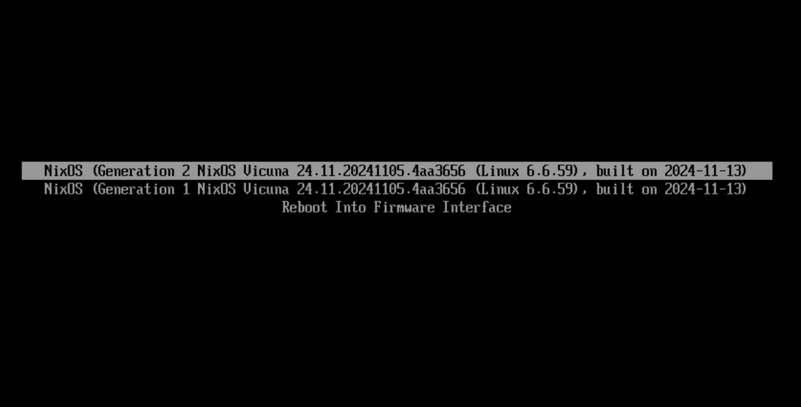

import { Steps, FileTree, Aside } from '@astrojs/starlight/components';

So this is it, we have an installer flash drive and our system configured how we like.

In this chapter we will...

1. Boot into our installer image
2. Wipe and prepare our disk for install
3. Create a hardware config for our system
4. **Install NixOS!**
5. Cleanup after install
6. Learn how to use NixOS on a real system

## Booting The Installer

To get started, I'd recommend opening this guide on another device that you can look at while installing. For obvious reasons you won't have access to this while installing.

Plug in the flashdrive, reboot you system to the boot menu (usually by spamming F12 while the computer is starting) and select the flashdrive from the boot menu.

You'll be shown a screen with the NixOS logo, select the first option and it should begin to boot.



After booting you'll be greeted with a shell. The initial message goes over how to get wireless networking set up if needed, we'll assume you were able to.

## Disk Prep

First we need to get the main disk ready for NixOS. To do this we *will have to wipe it*.

To get started, find the block device path of your main disk. For NVME this will usually be `/dev/nvme0n1`, for others it may be `/dev/sdX`. You can use the `lsblk` command to find it based on size.

Now, run the following, replacing `DEV_PATH` with the device path.

```sh "DEV_PATH"
sudo cgdisk DEV_PATH
```

This opens a interactive TUI for partitioning disks, we'll use this to layout the disk for NixOS.

You'll need to do a few things here.

<Steps>
1. Delete any partitions present on the disk
2. New partition, this will be the boot partition.
   <Steps>
   1. Press Enter - Uses default start section for our new partition
   2. Enter `512M` for a 512 MiB boot partition
   3. For hex code enter `ef00`, this marks it as a EFI boot partition
   4. Name this `BOOT` or whatever you want
   </Steps>
3. Next you can optionally set swap memory, if you do set this I'd recommend making it the size of physical memory you have.
   <Steps>
   1. New partition (below the boot partition)
   2. Press Enter
   3. Enter the size you desire for the swap partition. (ex. `4G` for 4 GB)
   4. For hex code enter `8200`, for "Linux Swap"
   5. Name this `SWAP` or whatever you want
   </Steps>
4. Finally allocate the rest of the disk space to your actual system
   <Steps>
   1. New partition (below the other partitions)
   2. Press enter
   3. For size simply press enter, this will make it go to the end of the disk
   4. For hex code press enter (`8300`), for "Linux Filesystem"
   5. You can name this `NIXOS` or whatever you want
   </Steps>
5. Your `cgdisk` should look something like this
   
6. Finally select `[Write]` at the bottom, this will commit all changes to the disk
7. Quit
</Steps>

Now we need to create filesystems on the new partitions we made.

When I put `PARTITION_PATH` in the commands below I *don't* mean just the device path.

- For NVME drives a partition should be at `/dev/nvme0n1p#` where `#` is replace with the partition number.
- For SATA drives it should be at `/dev/sdX#` where `#` is replaced with the partition number.

So with this in mind:

<Steps>
1. Setup your *boot partition* (partition `1`) 
   ```sh "PARTITION_PATH"
   sudo mkfs.fat -F 32 PARTITION_PATH
   ```
2. **If you did swap**, Setup your *swap partition* (partition `2`): 
   ```sh "PARTITION_PATH"
   sudo mkswap PARTITION_PATH
   ```
3. **If you did swap**, Enable swapping
   ```sh "PARTITION_PATH"
   sudo swapon PARTITION_PATH
   ```
4. Setup your *main partition* (`3` **if you did swap**, `2` otherwise)
   ```sh "PARTITION_PATH" "NIXOS"
   sudo mkfs.ext4 PARTITION_PATH -L NIXOS
   ```
</Steps>

Great! We've fully primed our disk for install.

## Mounting Disks

Next we need to mount the disks we just created so we can write to them.

`PARTITION_PATH` will be the same as outlined above.

<Steps>
1. Mount the *main partition* (`3` **if you did swap**, `2` otherwise)
   ```sh "PARTITION_PATH"
   sudo mount PARTITION_PATH /mnt
   ```
2. Create the directory for the boot partition
   ```sh
   sudo mkdir /mnt/boot
   ```
3. Mount the *boot partition* (partition `1`)
   ```sh "PARTITION_PATH"
   sudo mount PARTITION_PATH /mnt/boot
   ```
</Steps>

<Aside>
The swap partition doesn't need to be mounted as we did `swapon` earlier, enabling swap.
</Aside>

Our disks are now mounted for setup!

## Getting our Flake

Almost ready now. But first, we'll copy our system flake to our newly mounted drive.

<Steps>
1. Make the folder to store the flake in
   ```sh
   sudo mkdir /mnt/flake
   ```
2. Copy the flake to our newly mounted drive, note the `/*`! This copies the folder contents and not the symlink.
   ```sh
   sudo cp -r /etc/flake/* /mnt/flake
   ```
3. Set the proper permissions so we can edit it
   ```sh
   sudo chmod -R 777 /mnt/flake
   ```
</Steps>

The layout of `/mnt` should now look like this.

<FileTree>
- /mnt/ mounted to partition 3 (or 2)
  - /mnt/boot/ mounted to partition 1
  - **/mnt/flake/** our flake, ready to edit
    - flake.nix
    - ...
</FileTree>

## Adding our Hardware Config

Now we need to add a hardware-specific module to our NixOS config for this computer.

This tells NixOS where disks are, what CPU we're running, etc.

```sh
sudo nixos-generate-config --root /mnt --show-hardware-config > /mnt/flake/hardware-configuration.nix
```

This will generate hardware-specific config for your system. Take a look at it with `cat` to see what it does.

<FileTree>
- /mnt/flake
  - flake.nix
  - ...
  - **hardware-configuration.nix**
</FileTree>

Now add this new module to `modules` for your system in `/mnt/flake/flake.nix` (you can use `vim` here):

```nix title=flake.nix ins={4}
modules = [
    ./modules/config.nix
    # ...
    ./hardware-configuration.nix
];
```

Now check one more time to make sure the system's okay.

```sh
nix flake check
```

If the flake check passed then we should be good to go!

## Installing

Now for the big install. Replace `YOURNAME` in the following command with your system's name:

```sh "YOURNAME"
cd /mnt/flake
sudo nixos-install --no-channel-copy --root /mnt --flake ".#YOURNAME"
```

This does a few things

1. Don't copy channels, we're flakes all the way
2. Set the root of the install to `/mnt`, our main disk
3. Build our system from the current directory (our flake), a system called `YOURNAME`

Press enter and wait for the system to build.

After the system builds fully, it will prompt you for a root password for the new system. Enter whatever you wish here (just don't forget it).

NixOS is now installed! Before rebooting:

```sh
cd /
sudo umount /mnt/boot
sudo umount /mnt
```

Finally

```sh
sudo reboot
```

Your system will then reboot! Take out your installation medium now.

## First Boot

The system should initialize and reach some sort of greeter (`logind`, `tuigreet`, `SDDM`, `GDM`, etc depending on what you set up). 

Before attempting to login (you can't). We need to set your user password.

<Steps>
   1. (*If you have a graphical greeter*): Switch TTYs with `Ctrl+Alt+F2`. (You may need to hold `Fn` as well on a laptop)
   2. Login as `root` with the password you setup in the installer
   3. Run `passwd` to change your user accounts password. Replacing `YOURUSER` with you user account's name.
      ```sh "YOURUSER"
      passwd YOURUSER
      ```
   4. Enter the password you wish to use 
   5. Logout with `exit` (or press `Ctrl+D`)
   6. (*If you have a graphical greeter*): Switch back to TTY 1 with `Ctrl+Alt+F1`
</Steps>

Now log in to your new system!

## Post-Install Config Housekeeping

### Grabbing Our Flake Again

After logging in I'd recommend grabbing your flake from `/flake` and copying it to somewhere in your home folder for editing. The flake will no longer have a git repo associated with it so you may need to re-run `git init`. 

Either way make sure to commit your new `hardware-configuration.nix` file and push if applicable.

You can remove `/flake` once you're done this.

### Disable the QEMU Guest Agent

We don't need QEMU guest agent anymore as we're on the read deal now.

```nix title=config.nix del={2}
# ...
services.qemuGuest.enable = true;
# ...
```

You can also optionally remove the `vm` recipe from your `justfile`

```txt title=justfile "YOURNAME" del={3-8}
# ...

[private]
alias vm := run-vm
# f: run VM of test
run-vm:
    nom build .#nixosConfigurations.YOURNAME.config.system.build.vm
    nix run .#nixosConfigurations.YOURNAME.config.system.build.vm
```

### Organizing hardware-configuration.nix

Finally, we placed `hardware-configuration.nix` in the root of the repo for simplicity, but feel free to move it to wherever you like (maybe make a folder for different hardware configs and name it your system name).

<FileTree>
- flake.nix
- flake.lock
- computers/
  - **YOURNAME.nix**
- modules/
  - config.nix
  - ...
</FileTree>

<Aside type="caution">
Just make sure to update the reference to it in `flake.nix`!

```nix title=flake.nix "YOURNAME" ins={5} del={4}
modules = [
   ./config.nix
   # ...
   ./hardware-configuration.nix
   ./computers/YOURNAME.nix
];
```
</Aside>

## Working In NixOS

Now that we're fully in NixOS we need to know a few more things.

### Switching

Switching is the process of pointing your running system to another config and activating it.

```sh
sudo nixos-rebuild switch --flake .#
``` 

Notice how we don't need a name here, it'll look for a config that matches the system's hostname by default.

For convenience this is in your `justfile`, to rebuild and switch to a new config, run `just s`.

<Aside>You must be in your flake's directory for `just` to see your `justfile`</Aside>

### Building

Of course you don't always have to switch, you can also just build the system without switching.

```sh
nom build .#nixosConfigurations.YOURNAME.config.system.build.toplevel
``` 

Replace `YOURNAME` with your system config's name. This is also included in your `justfile`, run `just b` to build your system.

This is nice for when you're making a big change and don't want to change immediately.

### Updating

Something we never really talked about was updating. Updating NixOS is as simple as changing with commit of `nixpkgs` we pull.

Nix can automatically update all inputs to their latest commits with flakes.

```sh
nix flake update
```

You can also use `just u` as a shortcut.

<Aside>
I had you setup your flake following the `nixos-unstable` branch of `nixpkgs`. This is generally a sound default as it's pretty up-to-date and doesn't break often. You can also change the input to point to `master` for more cutting-edge (like **VERY** cutting-edge) updates.
</Aside>

### Garbage Collection

You'll also need to be able to garbage collect so you have plenty of free disk space.

```sh
nix-collect-garbage -d
sudo nix-collect-garbage -d
```

Note that these do two different things and should both be run. You can also use `just gc` as a shortcut.

### Rollback

When booting, `systemd-boot` will display all previous NixOS generations, you can boot from any one of these.



This is very handy if you mess up your most recent config to be unbootable. With NixOS as long as you don't mess up your bootloader you can usually recover easily.

Also remember that you have a git repo to track your config, you can always rollback to a previous commit if needed.

### Running Non-NixOS Binaries

If you ever need to run binaries off the web without needing to setup an FHS, you can use `steam-run` (from the `steam-run` package) to run the binary.

```sh
steam-run ./my-bin
```

## The Story Doesn't End Here

Congrats on installing NixOS! Hopefully this guide has given you the tools you need to continue growing your config and joining the rest of us delusional people in trying to make our systems perfect.

<Aside type="tip">
There are a few things I think are still worth sharing that I didn't put in this book for simplicity. For some nice tips and more, check out the epilogue!
</Aside>
